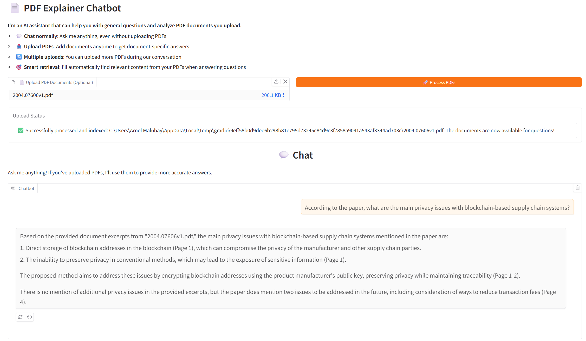

# 📄 PDF Explainer Using RAG

A powerful AI-powered chatbot that allows you to upload PDF documents and ask intelligent questions about their content using Retrieval-Augmented Generation (RAG) technology.

<p align="center"></p>

## 🚀 Features

- **🤖 Smart AI Assistant**: Works as a general-purpose chatbot even without uploaded documents
- **📤 PDF Upload & Processing**: Upload single or multiple PDF documents with automatic text extraction
- **🎯 RAG-Powered Responses**: Uses advanced embedding models to find relevant document content
- **💬 Streaming Responses**: Real-time streaming chat interface for smooth conversations
- **🔄 Multiple Uploads**: Add more PDFs during conversations to expand the knowledge base
- **📊 Table Support**: Enhanced extraction of tables and structured content from PDFs
- **🏷️ Source Citations**: Responses include filename and page number references
- **🐳 Docker Ready**: Easy deployment with Docker containerization

## 🛠️ Technologies Used

- **Frontend**: [Gradio](https://gradio.app/) - Interactive web interface
- **LLM**: [Groq](https://groq.com/) with Llama 3.1 8B Instant model
- **PDF Processing**: [PyMuPDF4LLM](https://pypi.org/project/pymupdf4llm/) - Optimized for LLM workflows
- **Vector Database**: [ChromaDB](https://www.trychroma.com/) - Efficient similarity search
- **Embeddings**: [BGE-small-en-v1.5](https://huggingface.co/BAAI/bge-small-en-v1.5) - High-quality text embeddings
- **Text Chunking**: [LangChain Text Splitters](https://python.langchain.com/docs/modules/data_connection/document_transformers/) - Intelligent text segmentation

## 📋 Prerequisites

- Python 3.8+
- Groq API key (free at [console.groq.com](https://console.groq.com))

## 🌐 Online Access

You can access the app freely on HuggingFace Spaces via this [link](https://huggingface.co/spaces/arnel8888/pdf-explainer-using-RAG)

## 🔧 Installation

### Local Setup

1. **Clone the repository**:
   ```bash
   git clone https://github.com/your-username/pdf-explainer-using-rag.git
   cd pdf-explainer-using-rag
   ```

2. **Create virtual environment**:
   ```bash
   python -m venv proj_env
   source proj_env/bin/activate  # On Windows: proj_env\Scripts\activate
   ```

3. **Install dependencies**:
   ```bash
   pip install -r requirements.txt
   ```

4. **Set up environment variables**:
   ```bash
   # Create .env file
   echo "GROQ_API_KEY=your_groq_api_key_here" > .env
   ```

5. **Run the application**:
   ```bash
   cd app
   python app.py
   ```

6. **Access the application**:
   Open your browser and go to `http://localhost:7860`

### Docker Setup

1. **Build the Docker image**:
   ```bash
   docker build -t pdf-explainer .
   ```

2. **Run the container**:
   ```bash
   docker run -p 7860:7860 -e GROQ_API_KEY=your_groq_api_key_here pdf-explainer
   ```

3. **Access the application**:
   Open your browser and go to `http://localhost:7860`

## 🎯 Usage

### Getting Started

1. **Open the application** in your web browser
2. **Start chatting** immediately - the AI works as a general assistant without any uploads
3. **Upload PDFs** (optional) using the file upload section
4. **Ask questions** about your documents - the AI will automatically find and use relevant content

### Example Workflows

**General Chat** (No PDFs needed):
```
User: "What are the benefits of renewable energy?"
AI: [Provides general knowledge response]
```

**Document-Specific Questions** (After uploading PDFs):
```
User: "What is the main conclusion of the research paper?"
AI: "According to the research paper (research_paper.pdf, Page 15), 
     the main conclusion is that renewable energy adoption..."
```

**Multi-Document Analysis**:
```
User: "Compare the methodologies mentioned in both documents"
AI: "Comparing the methodologies:
     
     From methodology_paper.pdf (Page 3): [methodology A details]
     From comparison_study.pdf (Page 7): [methodology B details]..."
```

## 📁 Project Structure

```
pdf-explainer-using-rag/
├── app/
│   ├── app.py              # Main Gradio application
│   ├── llm.py              # LLM integration with RAG
│   ├── retrieval.py        # PDF processing and vector operations
├── Dockerfile              # Docker configuration
├── .dockerignore           # Docker ignore rules
├── .gitignore              # Git ignore rules
└── requirements.txt        # Python dependencies
└── README.md               # This file
```

## ⚙️ Configuration

### Environment Variables

| Variable | Description | Required |
|----------|-------------|----------|
| `GROQ_API_KEY` | Your Groq API key for LLM access | Yes |

### Customizable Parameters

**In `retrieval.py`**:
- `chunk_size`: Text chunk size (default: 500)
- `chunk_overlap`: Overlap between chunks (default: 150)
- `top_k`: Number of retrieved documents (default: 5)

**In `llm.py`**:
- `model`: Groq model name (default: "llama-3.1-8b-instant")
- `temperature`: Response creativity (default: 0.7)

## 🔍 How It Works

1. **PDF Upload**: Documents are parsed using PyMuPDF4LLM with markdown formatting
2. **Text Processing**: Content is cleaned and split into semantic chunks
3. **Embedding**: Text chunks are converted to vectors using BGE embeddings
4. **Storage**: Vectors and metadata are stored in ChromaDB
5. **Retrieval**: User questions trigger similarity search for relevant chunks
6. **Generation**: LLM generates responses using retrieved context and chat history

## 🚀 Deployment Options

### Local Development
- Run directly with Python for development and testing

### Docker Container
- Production-ready containerized deployment
- Includes pre-downloaded embedding models for faster startup

### Cloud Deployment
- Compatible with any cloud platform supporting Docker
- Requires Groq API key as environment variable

## 🤝 Contributing

1. Fork the repository
2. Create a feature branch (`git checkout -b feature/amazing-feature`)
3. Commit your changes (`git commit -m 'Add amazing feature'`)
4. Push to the branch (`git push origin feature/amazing-feature`)
5. Open a Pull Request

